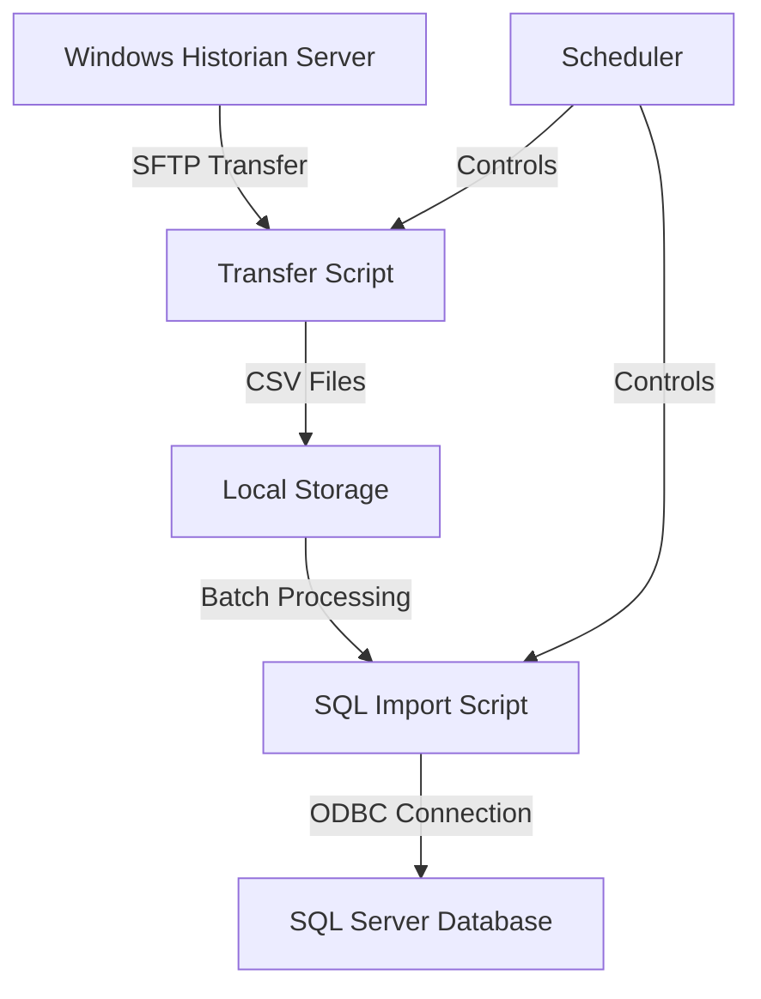

# Historian Data Transfer System

A robust ETL (Extract, Transform, Load) pipeline designed for industrial time-series data transfer. This system automates the secure transfer of historian data from Windows servers to SQL Server databases, featuring comprehensive error handling, data validation, and efficient batch processing.

## 🌟 Key Features

- Automated SFTP data transfer from Windows historian servers
- High-performance SQL Server batch importing with ODBC Driver 18
- Smart data merging with duplicate prevention and retention policies
- Configurable daily scheduling with error recovery
- Comprehensive rotating logs system
- Docker containerization for easy deployment
- Data validation and quality checks
- File locking mechanism to prevent concurrent access

## 🏗 System Architecture



## 📋 Prerequisites

- Docker and Docker Compose
- Network access to historian server
- SQL Server with ODBC Driver 18
- Minimum 4GB RAM recommended
- Storage space for data files (dependent on retention policy)
- Python 3.10+ (for development only)

## 🚀 Quick Start

1. **Clone the Repository**
   ```bash
   git clone https://github.com/yourusername/historian-transfer-system.git
   cd historian-transfer-system
   ```

2. **Configure Environment**
   ```bash
   cp .env.example .env
   # Edit .env with your configurations:
   # - Database credentials
   # - SFTP connection details
   # - Scheduling preferences
   ```

3. **Create Required Directories**
   ```bash
   mkdir -p logs historian_exports/temp
   chmod 755 logs historian_exports
   ```

4. **Initialize Database**
   ```bash
   # Connect to your SQL Server instance and run db_setup.sql
   sqlcmd -S localhost -U SA -i db_setup.sql
   ```

5. **Launch the System**
   ```bash
   docker-compose up -d
   ```

## 🔧 Core Components

### SFTP Transfer Module (sftp_script.py)
- Secure file transfer using paramiko
- File locking mechanism prevents concurrent transfers
- Intelligent file merging with duplicate detection
- Configurable data retention (default: 90 days)
- Temporary storage handling for atomic operations

### SQL Import Module (sql_import.py)
- Efficient batch importing with configurable batch sizes
- Memory-optimized large dataset handling
- Automatic retry logic for failed operations
- Duplicate record prevention
- Data type validation and conversion

### Scheduler (scheduler.py)
- Configurable execution times
- Automatic retry on failure
- Comprehensive logging
- Process monitoring
- Health checks

## ⚙️ Configuration

### Environment Variables (.env)
```ini
# Database Configuration
DB_HOST=localhost
DB_NAME=HistorianData
DB_USER=historian_user
DB_PASSWORD=YourStrongPassword

# SFTP Configuration
SFTP_HOST=historian.example.com
SFTP_USER=historian_sftp
SFTP_PASSWORD=YourSFTPPassword

# Schedule Configuration
TRANSFER_TIME=02:00
RETRY_ATTEMPTS=3
```

### Docker Configuration (docker-compose.yml)
- Host network mode for optimal database connectivity
- Timezone configuration
- Volume mapping for persistent storage
- Automatic container restart policy

## 📊 Logging System

Comprehensive logging with rotation policy:
- `logs/transfer.log`: SFTP operations
- `logs/sql_import.log`: Database operations
- `logs/scheduler.log`: Scheduling events

Log rotation settings:
- Maximum size: 10MB per file
- Retention: 5 backup files
- Log level: INFO (configurable)

## 🛠 Development Setup

1. **Create Virtual Environment**
   ```bash
   python -m venv venv
   source venv/bin/activate  # or `venv\Scripts\activate` on Windows
   ```

2. **Install Dependencies**
   ```bash
   pip install -r requirements.txt
   ```

3. **Run Tests**
   ```bash
   python -m pytest tests/
   ```

## 🔒 Security Features

- SFTP for secure file transfer
- File locking prevents race conditions
- Environment variable-based credential management
- SQL injection prevention through parameterized queries
- Network access control via firewall rules
- Secure ODBC connections with TLS

## 🔍 Monitoring and Maintenance

Regular maintenance tasks:
- Monitor log files for errors
- Verify data integrity
- Check disk space usage
- Update security credentials
- Review database performance metrics

### Performance Monitoring
```sql
-- Check data import status
SELECT COUNT(*) as record_count, 
       MAX(ImportDate) as last_import
FROM TagData;
```

## 🤝 Contributing

1. Fork the repository
2. Create a feature branch (`git checkout -b feature/AmazingFeature`)
3. Commit changes (`git commit -m 'Add AmazingFeature'`)
4. Push to branch (`git push origin feature/AmazingFeature`)
5. Open a Pull Request

## 📝 License

This project is licensed under the MIT License - see the [LICENSE](LICENSE) file for details.

## 🆘 Troubleshooting

Common issues and solutions:
- Database connection failures: Check ODBC driver installation
- SFTP timeouts: Verify network connectivity and firewall rules
- Lock file issues: Remove stale lock files if process terminated abnormally
- Memory issues: Adjust batch size in configuration

## 📞 Support

For issues and feature requests:
- Open an issue in the GitHub repository
- Contact the maintenance team
- Check the documentation wiki