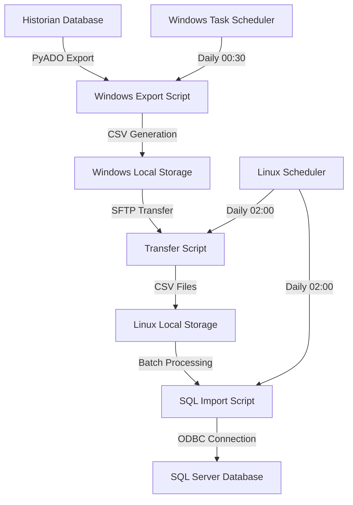

# Historian Data Transfer System

A robust ETL (Extract, Transform, Load) pipeline designed for industrial time-series data transfer. This system combines Windows-based data extraction with Linux-based processing and storage, automating the secure transfer of historian data to SQL Server databases, featuring comprehensive error handling, data validation, and efficient batch processing.

## 🌟 Key Features

- Automated Windows-based historian data extraction
- Automated SFTP data transfer from Windows historian servers
- High-performance SQL Server batch importing with ODBC Driver 18
- Smart data merging with duplicate prevention and retention policies
- Configurable daily scheduling with error recovery
- Comprehensive rotating logs system
- Docker containerization for easy deployment
- Data validation and quality checks
- File locking mechanism to prevent concurrent access

## 🏗 System Architecture



## 📋 Prerequisites

- Windows Server with:
  - Python 3.10+
  - PyADO library
  - Access to Historian database
  - Task Scheduler access
- Linux Server with:
  - Docker and Docker Compose
  - Network access to Windows server
  - SQL Server with ODBC Driver 18
  - Minimum 4GB RAM recommended
  - Storage space for data files (dependent on retention policy)

## 🚀 Quick Start

1. **Clone the Repository**
   ```bash
   git clone https://github.com/yourusername/historian-transfer-system.git
   cd historian-transfer-system
   ```

2. **Windows Server Setup**
   - Install Python and required dependencies
   ```bash
   pip install PyADO pandas numpy
   ```
   - Configure the historian export script settings in `windows_historian_export.py`:
   ```python
   EXPORT_PATH = "C:\\Users\\Administrator\\Desktop\\PROCESS_SERVER_BACKUP_SCRIPT\\historian_exports"
   # Configure Historian connection
   conn = PyADO.connect(None, host='your_historian_host', 
                       user='your_username', 
                       password='your_password', 
                       provider='iHOLEDB.iHistorian.1')
   ```
   - Set up Windows Task Scheduler:
     - Create new task to run daily at 00:30
     - Action: Start Program
     - Program: python
     - Arguments: "full_path_to\\windows_historian_export.py"

3. **Linux Server Setup**
   Edit the following files with your configurations:
   ```python
   # In sftp_script.py:
   self.hostname = "your_hostname"
   self.username = "your_username"
   self.password = "your_PASSWORD"

   # In sql_import.py:
   self.conn_str = (
       "DRIVER={ODBC Driver 18 for SQL Server};"
       "SERVER=your_hostname;"
       "DATABASE=your_database;"
       "UID=your_username;"
       "PWD=your_PASSWORD;"
       "TrustServerCertificate=yes"
   )
   ```

4. **Create Required Directories**
   ```bash
   mkdir -p logs historian_exports/temp
   chmod 755 logs historian_exports
   ```

5. **Initialize Database**
   ```bash
   # Connect to your SQL Server instance and run db_setup.sql
   sqlcmd -S localhost -U SA -i db_setup.sql
   ```

6. **Launch the System**
   ```bash
   docker-compose up -d
   ```

## 🔧 Core Components

### Windows Historian Export (windows_historian_export.py)
- Direct historian data extraction using PyADO
- Configurable time range for data export
- Automatic data aggregation and formatting
- CSV file generation with timestamp-based naming
- Comprehensive error handling and logging
- Default 10-day data retention policy

### SFTP Transfer Module (sftp_script.py)
- Secure file transfer using paramiko
- File locking mechanism prevents concurrent transfers
- Intelligent file merging with duplicate detection
- Configurable data retention (default: 90 days)
- Temporary storage handling for atomic operations

[Rest of the sections remain the same...]

## ⚙️ Scheduling Configuration

### Windows Task Scheduler (windows_historian_export.py)
The historian export script runs daily at 00:30 AM via Windows Task Scheduler.
- Task Name: Historian Data Export
- Trigger: Daily at 00:30 AM
- Action: Run Python script
- Recovery: Auto-restart on failure

### Linux Scheduler (scheduler.py)
The transfer and import processes run daily at 02:00 AM:
```python
# Schedule the job to run at 02:00
schedule.every().day.at("02:00").do(run_scripts, logger)
```

[Rest of the sections remain the same...]

## 📊 Data Flow Timeline

1. 00:30 AM - Windows historian export begins
2. ~01:30 AM - Export typically completes (depending on data volume)
3. 02:00 AM - Linux-based SFTP transfer initiates
4. ~02:30 AM - SQL import process begins
5. ~03:30 AM - Full process typically completes

## ⚙️ Configuration

### Credentials Configuration
Credentials and connection details are configured directly in the Python scripts:

#### SFTP Configuration (sftp_script.py)
```python
class HistorianTransfer:
    def __init__(self):
        self.hostname = "your_hostname"
        self.username = "your_username"
        self.password = "your_PASSWORD"
        self.remote_path = r"C:\Users\Administrador\Desktop\PROCESS_SERVER_BACKUP_SCRIPT\historian_exports"
        self.local_path = "/home/mpp/historian_export/historian_exports"
```

#### Database Configuration (sql_import.py)
```python
class SQLImporter:
    def __init__(self):
        self.conn_str = (
            "DRIVER={ODBC Driver 18 for SQL Server};"
            "SERVER=your_hostname;"
            "DATABASE=your_database;"
            "UID=your_username;"
            "PWD=your_PASSWORD;"
            "TrustServerCertificate=yes"
        )
```

### Schedule Configuration (scheduler.py)
The system is configured to run daily at 02:00 AM. This can be modified in the scheduler.py file:
```python
# Schedule the job to run at 02:00
schedule.every().day.at("02:00").do(run_scripts, logger)
```

### Docker Configuration (docker-compose.yml)
- Host network mode for optimal database connectivity
- Timezone configuration
- Volume mapping for persistent storage
- Automatic container restart policy

## 📊 Logging System

Comprehensive logging with rotation policy:
- `logs/transfer.log`: SFTP operations
- `logs/sql_import.log`: Database operations
- `logs/scheduler.log`: Scheduling events

Log rotation settings:
- Maximum size: 10MB per file
- Retention: 5 backup files
- Log level: INFO (configurable)

## 🛠 Development Setup

1. **Create Virtual Environment**
   ```bash
   python -m venv venv
   source venv/bin/activate  # or `venv\Scripts\activate` on Windows
   ```

2. **Install Dependencies**
   ```bash
   pip install -r requirements.txt
   ```

3. **Run Tests**
   ```bash
   python -m pytest tests/
   ```

## 🔒 Security Features

- SFTP for secure file transfer
- File locking prevents race conditions
- Environment variable-based credential management
- SQL injection prevention through parameterized queries
- Network access control via firewall rules
- Secure ODBC connections with TLS

## 🔍 Monitoring and Maintenance

Regular maintenance tasks:
- Monitor log files for errors
- Verify data integrity
- Check disk space usage
- Update security credentials
- Review database performance metrics

### Performance Monitoring
```sql
-- Check data import status
SELECT COUNT(*) as record_count, 
       MAX(ImportDate) as last_import
FROM TagData;
```

## 🤝 Contributing

1. Fork the repository
2. Create a feature branch (`git checkout -b feature/AmazingFeature`)
3. Commit changes (`git commit -m 'Add AmazingFeature'`)
4. Push to branch (`git push origin feature/AmazingFeature`)
5. Open a Pull Request

## 📝 License

This project is licensed under the MIT License - see the [LICENSE](LICENSE) file for details.

## 🆘 Troubleshooting

Common issues and solutions:
- Database connection failures: Check ODBC driver installation
- SFTP timeouts: Verify network connectivity and firewall rules
- Lock file issues: Remove stale lock files if process terminated abnormally
- Memory issues: Adjust batch size in configuration

## 📞 Support

For issues and feature requests:
- Open an issue in the GitHub repository
- Contact the maintenance team
- Check the documentation wiki